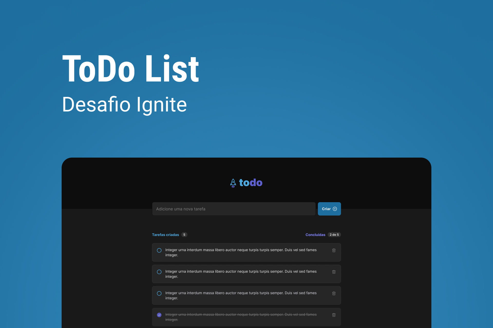

<h2 align="center">
	
</h2>

<p align="center">
	<a href="mailto:bortolettohenrique@gmail.com" target="_blank">
		
	</a>
	<a href="https://www.linkedin.com/in/henriquebortoletto/" target="_blank">
		
	</a>
</p>

---

## 🚀 Sobre

Desafio do primeiro modulo do ignite da plataforma `rocketseat`, cuja finalidade é fixar e praticar
os conceitos principais do react aplicado num projeto de Todo List.

- [Link](https://efficient-sloth-d85.notion.site/Desafio-01-Praticando-os-conceitos-do-ReactJS-91fd63dd1a5b4a2796152de293ec1074)

---

## 🪛 Instalação

Para rodar o repositório instale as dependencias com o comando abaixo.

```bash
# install dependencies
yarn
```

---

## 🧑‍💻 Tecnologias

- [x] [Gitflow](https://www.atlassian.com/git/tutorials/comparing-workflows/gitflow-workflow)
- [x] [React](https://pt-br.reactjs.org/)
- [x] [Husky](https://typicode.github.io/husky/#/)
- [x] [Conventional Commit](https://github.com/conventional-changelog/commitlint)

---

by [Henrique Bortoletto](https://github.com.br) :wave:
